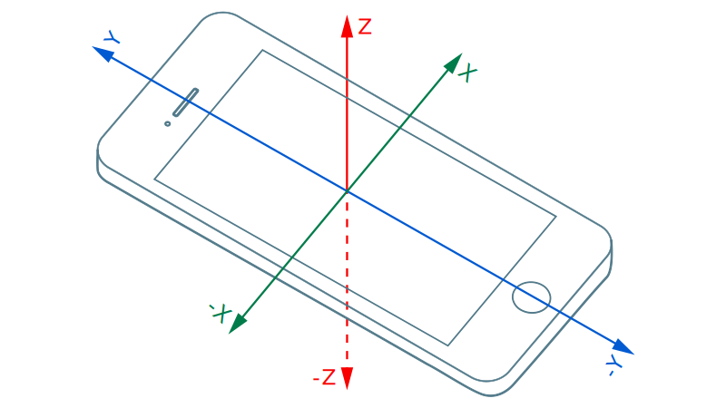
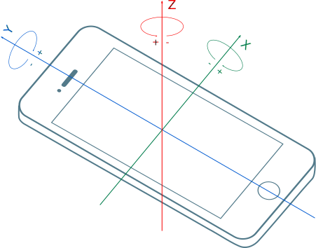
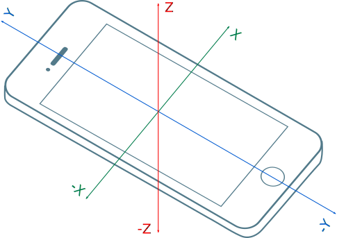

# SQLite con Processing

En este proyecto se aborda el uso de la librería Ketai submodulo data, el cual implementa la base de datos autocontenida SQLite. El propósito de esta actividad era el de recolectar datos provistos por los sensores incorporados en los teléfonos con el sistema operativo Android.

## Sensores analizados

Los sensores utilizados en este proyecto son:
* [Giroscopio](https://es.wikipedia.org/wiki/Gir%C3%B3scopo) - Para medir la posición de nuestro dispositivo
* [Magnetómetro](https://es.wikipedia.org/wiki/Magnet%C3%B3metro) - Para detectar la dirección del norte magnético
* [Acelerómetro](https://es.wikipedia.org/wiki/Aceler%C3%B3metro) - Para medir la aceleración del celular en los 3 ejes

### Requisitos

Para utilizar la aplicación de la forma que fue ideada, es necesario que el dispositivo cuente con los sensores mencionados anteriormente, especialmente tener en cuenta que el dispositivo venga integrado con un giroscopio, puesto que es el dispositivo menos frecuente en modelos Android de gama media y gama baja.

|Acelerómetro|Giroscopio|Magnetómetro|
|---|---|---|
||||


## Estructura
La tabla en la base de datos se construyo con el siguiente formato
```
CREATE TABLE IF NOT EXISTS sensor_data
  ( time INTEGER PRIMARY KEY, sensor INTEGER, x REAL, y REAL, z REAL)
```
Donde:
* *time* : tiempo en milisegundos del registro
* *sensor* : El sensor registrado
    * Acelerómetro = 0
    * Giroscopio = 1
    * Magnetómetro = 2
* *x, y, z* : los valores de los componentes de la lectura

### Fuentes
Para el desarrollo de este proyecto, se utilizó como referencia:
* Los ejemplos del libro [Rapid Android Development](https://github.com/ketai/rapid-android-development)
* La documentación de la librería [Ketai](http://ketai.org/reference/sensors/ketaisensor/)
* La documentación de la librería [SQLite](https://www.sqlite.org/docs.html)


### Creadores
* **Karyny Narayani Rodio** - *335661*
* **Erick Jassiel Blanco Sausameda** - *311008*
* **Oscar Eduardo Ordoñez Medina** - *310898*

Para la materia de Desarrollo Basado en Plataformas
